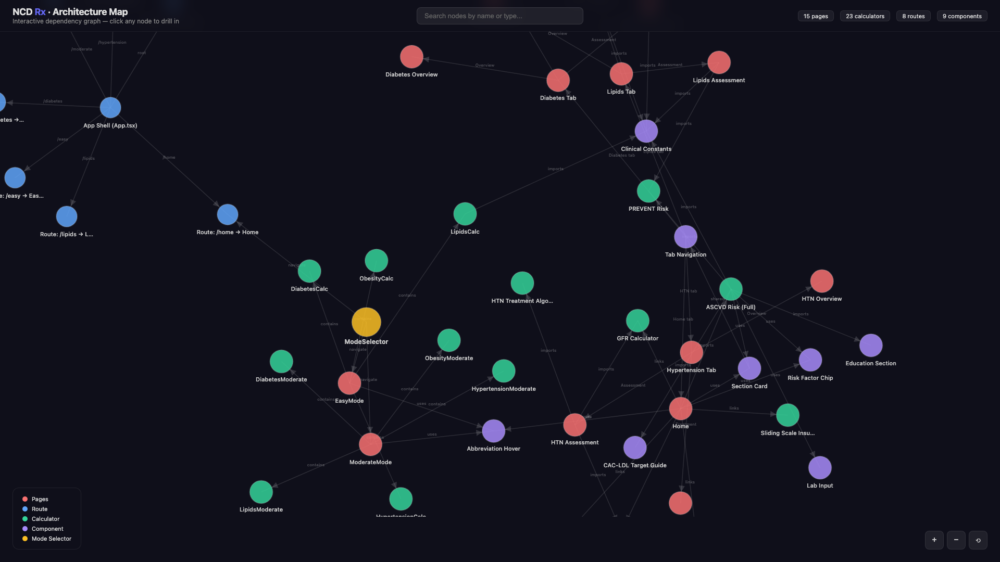

# NCD Rx — Clinical Decision Support Toolkit

**Three difficulty modes** for Diabetes, Hypertension, Lipids, and Obesity management.

## Live

- **Vercel**: https://ncd-combined.vercel.app
- **Mode Selector**: `/` → choose Easy, Moderate, or Complex

## Modes

| Mode | Route | What it does |
|------|-------|-------------|
| 🟢 **Easy** | `/easy` | Simple 4-NCD calculator. Few inputs, clear outputs. |
| 🟠 **Moderate** | `/moderate` | Guideline-integrated with risk stratification and comorbidity-based branching. |
| 🔴 **Complex** | `/home` | Full app: prescription generator, OCR upload, all calculators, LAI 2023 classification, PREVENT risk, treatment plans with US/India drug names. |

## Architecture

The project has **57 pages, 16 calculators, 8 routes, and 25+ shared components** organized in a dependency graph.

> Open **[ARCHITECTURE.html](./ARCHITECTURE.html)** in your browser for an interactive clickable map.
> Every node is drillable — click a page to see its sub-components, click a calculator to see what imports it.



### Key structure

```
src/
├── App.tsx                  # Root routing (React Router)
├── pages/
│   ├── ModeSelector.tsx     # Landing page (3 mode cards)
│   ├── EasyMode.tsx         # Easy: 4 inline calculators
│   ├── ModerateMode.tsx     # Moderate: 4 guideline-integrated
│   ├── Home.tsx             # Complex: full dashboard
│   ├── diabetes/
│   │   ├── DiabetesTab.tsx, DiabetesOverview.tsx
│   │   ├── DiabetesAssessment.tsx, DiabetesTreatment.tsx
│   ├── hypertension/
│   │   ├── HypertensionTab.tsx, HypertensionOverview.tsx
│   │   ├── HypertensionAssessment.tsx, HypertensionTreatment.tsx
│   ├── lipids/
│   │   ├── LipidsTab.tsx, LipidsOverview.tsx
│   │   ├── LipidsAssessment.tsx (LAI 2023), LipidsTreatment.tsx
├── calculators/
│   ├── diabetes/   (Insulin titration, hypo risk, sliding scale, renal dosing, DM algorithm)
│   ├── htn/        (GFR, drug interactions, treatment algorithm, potency table)
│   ├── lipids/     (ASCVD risk, lipid panel)
│   ├── obesity/    (BMI, waist-height, GLP-1 algorithm)
├── components/
│   ├── TabNavigation.tsx    # Complex mode nav (Home/Diabetes/HTN/Lipids)
│   ├── AbbreviationHover.tsx # 171 medical abbreviations with hover definitions
│   ├── calculator/          # CAC-LDL guide, education section
│   ├── med/                 # GLP-1 algorithm, clinical guidelines
│   └── ui/                  # shadcn-based: section-card, risk-factor-chip, lab-input
├── lib/
│   ├── clinicalConstants.ts # All ASCVD/CKD/TOD/FH criteria, LAI risk modifiers
│   ├── prevent.ts           # AHA PREVENT 10-year ASCVD risk equations
│   └── patient-data.ts      # Patient data helper
```

## Running locally

```sh
npm i
npm run dev
```

## Deploy

```sh
npx vercel deploy --prod
```
